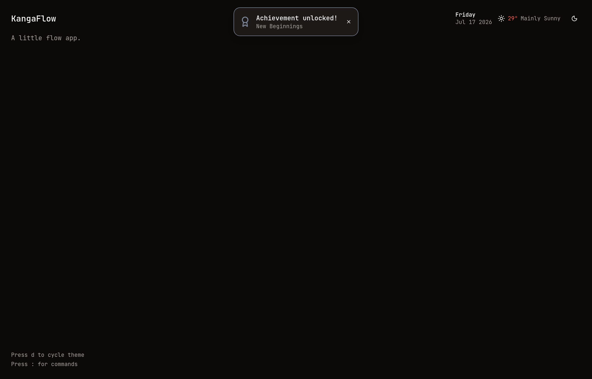

<!-- markdownlint-disable MD033 MD041 -->
> [!IMPORTANT]
> **Human review needed.** This file is AI-generated prose and has not yet been
> confirmed by a human. Remove this notice once reviewed (see AI_POLICY.md).

<div align="center">

<h1>🦘 KangaFlow</h1>

[**Live Demo**](https://kangazero.github.io/KangaFlow/) &nbsp;•&nbsp;
[Highlights](#highlights) &nbsp;•&nbsp;
[Requirements](#requirements) &nbsp;•&nbsp;
[Getting Started](#getting-started) &nbsp;•&nbsp;
[Tasks](#tasks) &nbsp;•&nbsp;
[AI Usage](#ai-usage)

**A bilingual, three-theme Next.js playground — vim command palette, unlockable
achievements, and live weather, shipped fully static to GitHub Pages.**

[](https://github.com/KangaZero/KangaFlow/stargazers)
[](./LICENSE)
[](https://kangazero.github.io/KangaFlow/)

[](https://github.com/KangaZero/KangaFlow/actions/workflows/deploy.yml)


<br/>

[](https://kangazero.github.io/KangaFlow/)

> **Type-safe, animation-forward, and shipped static** — a personal playground
> that treats polish as a feature.

</div>

## Table of Contents

- [Highlights](#highlights)
- [Tech Stack](#tech-stack)
- [Requirements](#requirements)
- [Getting Started](#getting-started)
- [Tasks](#tasks)
- [Project Layout](#project-layout)
- [Architecture Notes](#architecture-notes)
- [Deployment](#deployment)
- [AI Usage](#ai-usage)
- [License](#license)

## Highlights

| | |
| --- | --- |
| ⌨️ **Vim command palette** | Press <kbd>:</kbd> to open, type `:q` (or <kbd>Esc</kbd> / click-away / ✕) to close. Jump to any theme, page, or language. |
| 🎨 **Three themes** | Light · Dark · Terminal, with a View-Transition **circular reveal** on switch. Cycle with <kbd>d</kbd> or the toggle. |
| 🌏 **Bilingual (EN / 日本語)** | End-to-end **type-safe** i18n — invalid keys don't compile. Locale lives in the URL (`/en`, `/ja`). |
| 🏆 **Achievements** | Unlockable with rarities, secrets, a localStorage save, and an animated toast. |
| 🌤️ **Live weather + date** | Client-side [Open-Meteo](https://open-meteo.com/) fetch with a skeleton while loading. |
| ⚡ **Fully static** | No server — exported to GitHub Pages and deployed on every push to `main`. |

## Tech Stack

- **Next.js 16.3** (App Router, `output: "export"`) · **React 19** · **Tailwind CSS v4**
- **TypeScript 7** (the Go-native `tsc`), strict — `noUncheckedIndexedAccess`,
  `exactOptionalPropertyTypes`, and friends
- **[Biome](https://biomejs.dev/) 2.4** — one binary for the git hook, CI, and `just` (no ESLint/Prettier)
- **shadcn/ui** ("radix-mira") + **[animate-ui](https://animate-ui.com/)** + **Motion**
- **Vitest** for unit tests · **Nix flake** + **just** for a reproducible toolchain

## Requirements

> [!IMPORTANT]
> KangaFlow rides the bleeding edge on purpose: **Next.js 16.3 (preview)** and
> **TypeScript 7** (Go-native `tsc`). Stable Next.js 16.2 crashes on TS 7, so
> Next is pinned to a preview release via `experimental.useTypeScriptCli` —
> expect churn until 16.3 is GA.

- **Node.js 26** and **pnpm 11** — or simply run `nix develop`, which pins both
  (plus `just` and the git hooks) for a reproducible environment.
- A **modern browser**. The theme switch uses the
  [View Transitions API](https://developer.mozilla.org/docs/Web/API/View_Transitions_API);
  where it's unsupported the circular reveal is skipped and the theme still
  changes instantly.

> [!WARNING]
> This is a **static export** — there is no server. Anything needing a request
> (the weather box → Open-Meteo) runs client-side, and Next.js server features
> (middleware, route handlers, server actions, image optimization) are
> unavailable by design.

> [!NOTE]
> The production build bakes in the `/KangaFlow` base path, so preview `./out`
> with `just preview` (which mounts it under that path) rather than a bare
> static server — otherwise assets 404.

## Getting Started

With **Nix** (recommended — pins Node 26, pnpm, just, and the git hooks):

```bash
nix develop      # enter the dev shell
pnpm install
just dev         # http://localhost:3000
```

Without Nix, you'll need Node 26 + pnpm 11 yourself, then `pnpm install && just dev`.

## Tasks

Everything runs through `just`:

| Recipe | What it does |
| --- | --- |
| `just dev` | Start the dev server |
| `just build` | Production static export → `./out` |
| `just fix` | Auto-fix + format (Biome, writes) |
| `just lint` | Lint + format check, no writes (what CI runs) |
| `just typecheck` | Type-check with native TS 7 |
| `just test` | Run the Vitest suite |
| `just verify` | The full gate: lint + typecheck + test + build |
| `just preview` | Serve `./out` under the `/KangaFlow` base path |
| `just review` / `just review-count` | List / count files pending human review |
| `just push` | `verify`, then push (CI deploys) |

## Project Layout

```text
app/
  [lang]/            # /en and /ja (generateStaticParams, dynamicParams=false)
    achievements/    # achievements page
  page.tsx           # root — client redirect to the preferred locale
components/          # app components (theme toggle, command menu, header date…)
  ui/                # vendored shadcn primitives
  animate-ui/        # vendored animate-ui primitives
hooks/               # use-weather (Open-Meteo)
lib/
  i18n/              # typed dictionaries (en/ja) + t()
  themes.ts          # theme union + cycle (single source of truth)
  weather.ts         # WMO → icon + temperature colour
  achievements.ts    # catalogue + pure unlock/reconcile reducer
```

## Architecture Notes

- **Single source of truth.** Themes, locales, WMO codes, and the achievement
  catalogue are each declared once and their types/lists derive from it.
- **Static-export constraints.** No server or middleware: i18n routing is
  client-side, locale is chosen at `/` by a client redirect, and anything needing
  a request (weather) is fetched in the browser. Assets are served under the
  `/KangaFlow` base path with a `.nojekyll` marker.
- **Strict, no escape hatches.** `any` is banned; every user-facing string flows
  through i18n (a missing translation fails the build).

## Deployment

Pushing to `main` runs GitHub Actions: Biome CI → TS 7 type-check → Vitest →
static build → deploy to GitHub Pages. Locally, `just push` runs the same gate
first. Live at **<https://kangazero.github.io/KangaFlow/>**.

## AI Usage

This repository is built with AI assistance under a disclosed policy — see
[`AI_POLICY.md`](./AI_POLICY.md). AI-generated prose carries a *"Human review
needed"* marker until a human confirms it (`just review` tracks the backlog), and
AI-assisted commits disclose the tool via an `Assisted-by:` trailer.

## License

Released under the [MIT License](./LICENSE).
