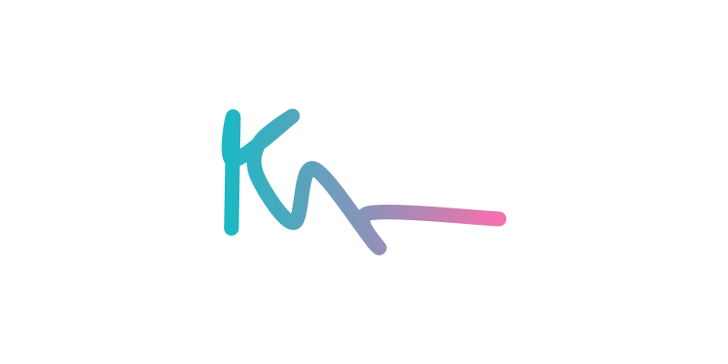
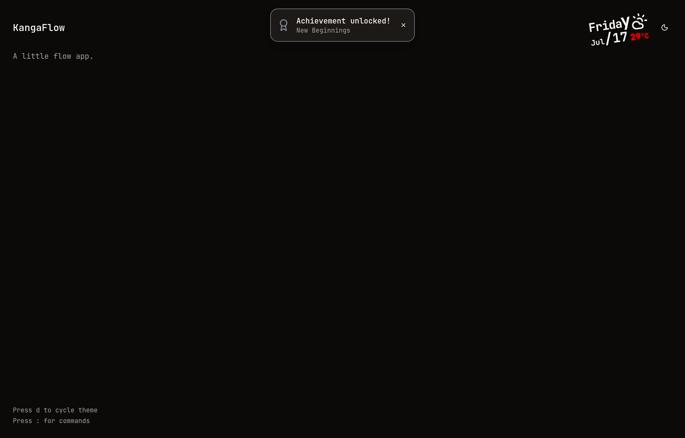

<!-- markdownlint-disable MD033 MD041 -->
> [!IMPORTANT]
> **Human review needed.** This file is AI-generated prose and has not yet been
> confirmed by a human. Remove this notice once reviewed (see AI_POLICY.md).

<div align="center">

<a href="https://kangazero.github.io/KangaFlow/">
  
</a>

<h1>🦘 KangaFlow</h1>

[**Live Demo**](https://kangazero.github.io/KangaFlow/) &nbsp;•&nbsp;
[Highlights](#highlights) &nbsp;•&nbsp;
[Requirements](#requirements) &nbsp;•&nbsp;
[Getting Started](#getting-started) &nbsp;•&nbsp;
[Tasks](#tasks) &nbsp;•&nbsp;
[AI Usage](#ai-usage)

**Two things in one static site:** a bilingual, three-theme **portfolio
playground** (vim command palette, unlockable achievements, live weather) **and a
from-scratch, in-browser recreation of my Linux desktop** — a niri-style tiling
window manager with a Noctalia-style bar, floating widgets, and a working
terminal. Shipped fully static to GitHub Pages.

[](https://github.com/KangaZero/KangaFlow/stargazers)
[](./LICENSE)
[](https://kangazero.github.io/KangaFlow/)

[](https://github.com/KangaZero/KangaFlow/actions/workflows/deploy.yml)


<br/>

[](https://kangazero.github.io/KangaFlow/)

<!-- TODO(human): drop in the real screenshot of the niri/Noctalia desktop at assets/screenshot-environment.png -->
[](https://kangazero.github.io/KangaFlow/en/environment)

**🚧 TODO:** environment screenshot — capture the `/environment` desktop and save it to `assets/screenshot-environment.png`.

> **Type-safe, animation-forward, and shipped static** — a personal playground
> that treats polish as a feature.

</div>

> [!NOTE]
> **Why "NNN"?** The desktop half of KangaFlow is a browser recreation of my real
> Linux rig — **n**iri (the scrollable-tiling Wayland compositor) · **N**octalia
> (the desktop shell / top bar) · **N**ix (the flake that pins the whole
> toolchain). The initialism is entirely on purpose; expansion left as an
> exercise for the reader, ideally in November. 😌

## Table of Contents

- [Highlights](#highlights)
- [Tech Stack](#tech-stack)
- [Requirements](#requirements)
- [Getting Started](#getting-started)
- [Tasks](#tasks)
- [Project Layout](#project-layout)
- [Architecture Notes](#architecture-notes)
- [For Agents (WebMCP)](#for-agents-webmcp)
- [Deployment](#deployment)
- [AI Usage](#ai-usage)
- [Credits](#credits)
- [License](#license)

## Highlights

| | |
| --- | --- |
| ⌨️ **Vim command palette** | Press <kbd>:</kbd> to open, type `:q` (or <kbd>Esc</kbd> / click-away / ✕) to close. Jump to any theme, page, or language. |
| 🎨 **Three themes** | Light · Dark · Terminal, with a View-Transition **circular reveal** on switch. Cycle with <kbd>d</kbd> or the toggle. |
| 🌏 **Bilingual (EN / 日本語)** | End-to-end **type-safe** i18n — invalid keys don't compile. Locale lives in the URL (`/en`, `/ja`). |
| 🏆 **Achievements** | Unlockable with rarities, secrets, a localStorage save, and an animated toast. |
| 🌤️ **Live weather + date** | Client-side [Open-Meteo](https://open-meteo.com/) fetch with a skeleton while loading. |
| 🖥️ **niri desktop (NNN)** | A scrollable-tiling window manager with a Noctalia-style bar, workspaces, overview, and Alt-based keybinds (`Alt+H/J/K/L` focus, `Alt+T` float, `Alt+Z` align, `Alt+Shift+Q` close). |
| 🪟 **Floating widgets** | Draggable, resizable Notes (rich text), Clock (alarm / timer / stopwatch + laps), Calendar, and Media player — with click-to-front and a unified z-order. |
| 🔔 **Notifications** | Bell popover with a dismissible, data-driven list; fires on alarm / timer / stopwatch and supports "remind me in N min" reminders that persist across reloads. |
| ⌨️ **In-browser terminal** | An [xterm.js](https://xtermjs.org/) shell over a virtual filesystem (`ls`/`cat`/`cd`/`nvim`), fastfetch, and a CodeMirror editor — plus a launcher (`Alt+D`) and a desktop-settings panel. |
| ⚡ **Fully static** | No server — exported to GitHub Pages and deployed on every push to `main`. |

## Tech Stack

- **Next.js 16.3** (App Router, `output: "export"`) · **React 19** · **Tailwind CSS v4**
- **TypeScript 7** (the Go-native `tsc`), strict — `noUncheckedIndexedAccess`,
  `exactOptionalPropertyTypes`, and friends
- **[Biome](https://biomejs.dev/) 2.4** — one binary for the git hook, CI, and `just` (no ESLint/Prettier)
- **shadcn/ui** ("radix-mira") + **[animate-ui](https://animate-ui.com/)** + **Motion**
- **[xterm.js](https://xtermjs.org/)** (terminal) + **CodeMirror** (editor) for the desktop apps
- **Vitest** for unit tests · **Nix flake** + **just** for a reproducible toolchain

## Requirements

> [!IMPORTANT]
> KangaFlow rides the bleeding edge on purpose: **Next.js 16.3 (preview)** and
> **TypeScript 7** (Go-native `tsc`). Stable Next.js 16.2 crashes on TS 7, so
> Next is pinned to a preview release via `experimental.useTypeScriptCli` —
> expect churn until 16.3 is GA.

- **Node.js 26** and **pnpm 11** — or simply run `nix develop`, which pins both
  (plus `just` and the git hooks) for a reproducible environment.
- A **modern browser**. The theme switch uses the
  [View Transitions API](https://developer.mozilla.org/docs/Web/API/View_Transitions_API);
  where it's unsupported the circular reveal is skipped and the theme still
  changes instantly.

> [!WARNING]
> This is a **static export** — there is no server. Anything needing a request
> (the weather box → Open-Meteo) runs client-side, and Next.js server features
> (middleware, route handlers, server actions, image optimization) are
> unavailable by design.

> [!NOTE]
> The production build bakes in the `/KangaFlow` base path, so preview `./out`
> with `just preview` (which mounts it under that path) rather than a bare
> static server — otherwise assets 404.

## Getting Started

With **Nix** (recommended — pins Node 26, pnpm, just, and the git hooks):

```bash
nix develop      # enter the dev shell
pnpm install
just dev         # http://localhost:3000
```

Without Nix, you'll need Node 26 + pnpm 11 yourself, then `pnpm install && just dev`.

## Tasks

Everything runs through `just`:

| Recipe | What it does |
| --- | --- |
| `just dev` | Start the dev server |
| `just build` | Production static export → `./out` |
| `just fix` | Auto-fix + format (Biome, writes) |
| `just lint` | Lint + format check, no writes (what CI runs) |
| `just typecheck` | Type-check with native TS 7 |
| `just test` | Run the Vitest suite |
| `just verify` | The full gate: lint + typecheck + test + build |
| `just preview` | Serve `./out` under the `/KangaFlow` base path |
| `just review` / `just review-count` | List / count files pending human review |
| `just push` | `verify`, then push (CI deploys) |

## Project Layout

```text
app/
  [lang]/            # /en and /ja (generateStaticParams, dynamicParams=false)
    achievements/    # achievements page
    environment/     # the niri/Noctalia desktop (NNN)
  icon.svg           # favicon (App Router metadata convention) + favicon.ico
  page.tsx           # root — client redirect to the preferred locale
components/          # app components (theme toggle, command menu, header date…)
  niri/              # tiling engine, keymap, bar, launcher, settings, spatial view
  widgets/           # DraggableWindow + Notes / Alarm / Calendar / Media floats
  ui/                # vendored shadcn primitives
  animate-ui/        # vendored animate-ui primitives
hooks/               # use-weather (Open-Meteo)
lib/
  i18n/              # typed dictionaries (en/ja) + t()
  pages.ts           # routable pages + hrefs (single source of truth)
  webmcp.ts          # WebMCP tool descriptors (pure; see For Agents)
  themes.ts          # theme union + cycle (single source of truth)
  weather.ts         # WMO → icon + temperature colour
  achievements.ts    # catalogue + pure unlock/reconcile reducer
  notifications.ts   # notifications model + pure helpers
  z-order.ts         # single-source stacking bands for windows/overlays
providers/           # global state, locale, notifications, z-order (click-to-front)
```

## Architecture Notes

- **Single source of truth.** Themes, locales, WMO codes, the achievement
  catalogue, and the window stacking bands (`lib/z-order.ts`) are each declared
  once and their types/lists derive from it.
- **Client-side window manager.** The niri desktop is a pure, DOM-free reducer
  (`components/niri/engine.ts`) that owns all tiling/layout state; the view layer
  handles geometry (drag, click-to-front, pixel measurement) and dispatches back
  in. A shared z-order provider gives every window/overlay a coherent
  click-to-front order.
- **Static-export constraints.** No server or middleware: i18n routing is
  client-side, locale is chosen at `/` by a client redirect, and anything needing
  a request (weather) is fetched in the browser. Assets are served under the
  `/KangaFlow` base path with a `.nojekyll` marker.
- **Strict, no escape hatches.** `any` is banned; every user-facing string flows
  through i18n (a missing translation fails the build).

## For Agents (WebMCP)

This site publishes its navigation to AI agents running **in the browser** via
[WebMCP](https://github.com/webmachinelearning/webmcp) (W3C Web Machine
Learning CG). Rather than an agent guessing at links or clicking around, it
calls a tool.

| Tool | Arguments | Does | Reads or writes |
|---|---|---|---|
| `kangaflow-list-pages` | — | Lists the pages that can be navigated to | Read-only |
| `kangaflow-go-to-page` | `page` (string) | Navigates to a page by name; matching is case-insensitive and partial, so "the timeline page" works | Navigates |
| `kangaflow-language` | `language` (string, optional) | Switches between `en` and `ja`, or reports the current one when called with no argument | Changes the language |

An unknown `page` — or an unsupported `language` — answers with the list of real
ones, so the agent can retry without a second call. Omitting an optional
argument means *read*, never *guess*. A refusal also sets `isError: true` on the
result alongside the message, so an agent that checks the flag and one that only
reads the prose both get the same answer.

Driving the site through a tool unlocks the **Bleeding Edge** achievement — it
fires on the actions (navigate, switch language), not on the reads, so asking
what page you are on does not earn it.

**Trying it.** WebMCP ships behind a flag today:

- **Chrome 149+** — enable `chrome://flags/#enable-webmcp-testing` and relaunch.
  The [Model Context Tool Inspector extension](https://developer.chrome.com/docs/ai/webmcp)
  lists the registered tools and calls them by hand, which is the quickest check.
- **ChatGPT Desktop** — supported with no flag.
- Everywhere else `document.modelContext` is undefined and this is inert.

**How it is wired.** `lib/webmcp.ts` builds the descriptors and is pure, so it
unit-tests without a DOM or a router; `components/webmcp.tsx` is a client
component mounted in `app/[lang]/layout.tsx` that supplies the real navigation
and unregisters on unmount. The page list comes from `lib/pages.ts` — the same
source the header links, the keyboard shortcuts and the terminal's `cd` read —
so adding a page there makes it agent-navigable with no further work.

## Deployment

Pushing to `main` runs GitHub Actions: Biome CI → TS 7 type-check → Vitest →
static build → deploy to GitHub Pages. Locally, `just push` runs the same gate
first. Live at **<https://kangazero.github.io/KangaFlow/>**.

## AI Usage

This repository is built with AI assistance under a disclosed policy — see
[`AI_POLICY.md`](./AI_POLICY.md). AI-generated prose carries a *"Human review
needed"* marker until a human confirms it (`just review` tracks the backlog), and
AI-assisted commits disclose the tool via an `Assisted-by:` trailer.

## Credits

Everything below is someone else's work. npm dependencies are listed in
[`package.json`](./package.json); this section covers third-party code copied
into the repo, external data and services, fonts, and assets.

### Vendored UI code

| Source | License | Where |
| --- | --- | --- |
| [shadcn/ui](https://ui.shadcn.com/) (`radix-mira`) | MIT | `components/ui/` |
| [animate-ui](https://animate-ui.com/) | MIT + Commons Clause | `components/animate-ui/` |
| [React Bits](https://reactbits.dev/) | MIT + Commons Clause | `Carousel`, `BorderGlow`, `Counter`, `ElasticSlider`, `LightRays`, `Particles`, `PixelBlast`, the PillNav-style dock in `site-header`, the rolling `locale-transition` |
| [animate.css](https://github.com/animate-css/animate.css) | MIT | `components/bounceIn.css` |
| [oneko.js](https://github.com/adryd325/oneko.js) + the [lots-o-nekos](https://github.com/raynepaws/lots-o-nekos) fork | MIT | `lib/oneko.ts`, `assets/oneko/default.png` — sprite from the original *Neko* by Masayuki Koba |
| [KanjiVG](https://github.com/KanjiVG/kanjivg) | CC BY-SA 3.0 | stroke paths in `components/ui/apple-hello-effect.tsx` |

> [!NOTE]
> **Commons Clause** (animate-ui, React Bits) permits personal and commercial
> use but forbids selling or redistributing the components themselves — fine for
> a portfolio, relevant if this code is ever lifted into a product.

### Data & services

| Source | Terms | Used for |
| --- | --- | --- |
| [Open-Meteo](https://open-meteo.com/) | Data [CC BY 4.0](https://open-meteo.com/en/license); free below 10k calls/day, non-commercial | live weather in the header date box |
| 地球地図日本 (*Global Map of Japan*), [Geospatial Information Authority of Japan](https://www.gsi.go.jp/kankyochiri/globalmap.html), via [dataofjapan/land](https://github.com/dataofjapan/land) | Attribution to 地球地図日本 required; free for non-commercial use | ward geometry in `lib/tokyo-map-data.ts` (regenerate with `just map-data`) |
| [GitHub REST API](https://docs.github.com/en/rest) | GitHub ToS | follower count in the footer |

### Fonts

| Font | License | Role |
| --- | --- | --- |
| [Geist](https://github.com/vercel/geist-font) — Vercel × basement.studio | SIL OFL 1.1 | body sans |
| [JetBrains Mono](https://github.com/JetBrains/JetBrainsMono) | SIL OFL 1.1 | monospace (self-hosted) |
| [DotGothic16](https://github.com/fontworks-fonts/DotGothic16) — Fontworks | SIL OFL 1.1 | Japanese dot-matrix headings |
| [Nerd Fonts](https://github.com/ryanoasis/nerd-fonts) (Symbols Only) | MIT | terminal / fastfetch glyphs |

### Audio

Media-player tracks in `public/tracks/` are third-party recordings, included for
demonstration and not relicensed:

- **MapleStory — Intro Theme** © Wizet / Nexon
- **Bortkiewicz** — Nocturne *(Diana)*, Op. 24/1
- **Kapustin** — Eight Concert Etudes, Op. 40/7 — *Nikolai Lugansky*
- **Chopin** — Etude in A♭ major, Op. 10/10 — *Yunchan Lim*

<!-- TODO(human): confirm you're happy shipping these recordings, or swap them
     for public-domain / self-recorded performances. -->

### Wallpapers

<!-- TODO(human): `assets/wallpapers/{beach-path,cat-vibin,magma}.webp` have no
     recorded source. Add the photographer / license, or replace them. -->

### Inspiration (no code taken)

- **[niri](https://github.com/YaLTeR/niri)** — the scrollable-tiling Wayland
  compositor the desktop page imitates.
- **[Noctalia](https://github.com/noctalia-dev/noctalia-shell)** — the shell the
  top bar is modelled on.
- ***Persona 5*** (Atlus) — the header date box's angular red/cyan styling.

## License

Released under the [MIT License](./LICENSE).
